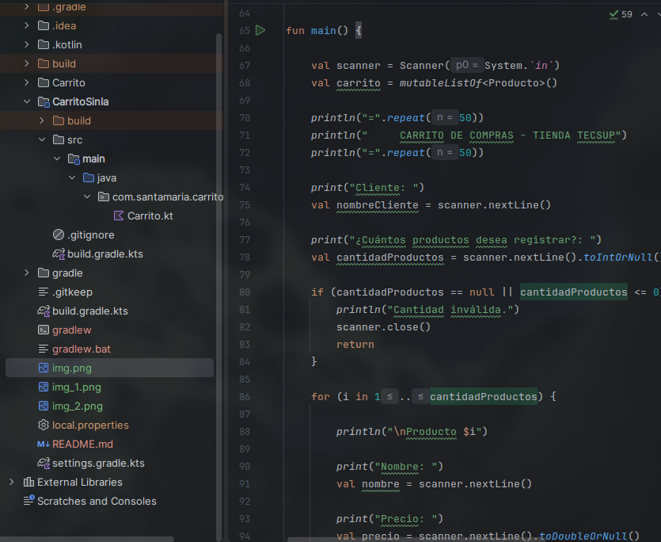
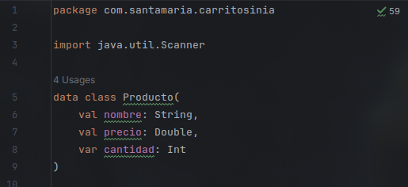
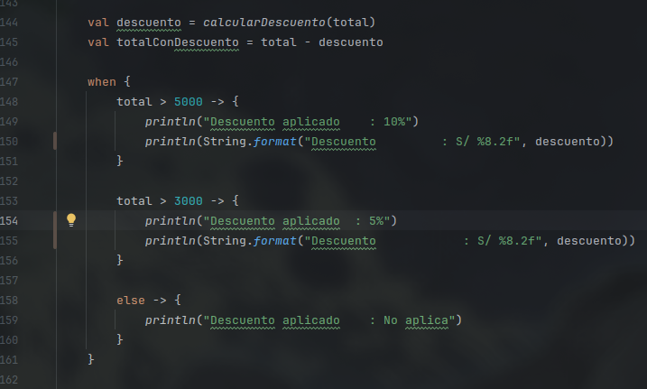
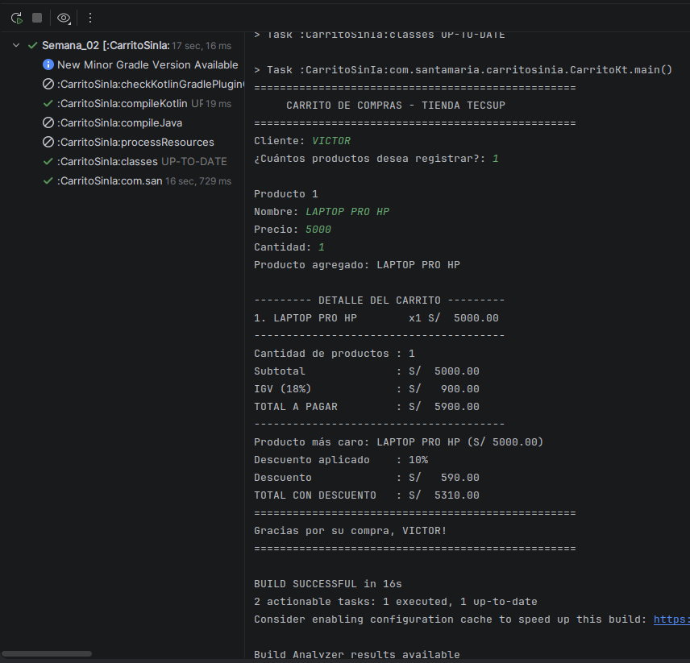

# Semana 02 — Carrito de compras en Kotlin

Laboratorio del curso de **Desarrollo de Aplicaciones Móviles** enfocado en el desarrollo de un carrito de compras por consola utilizando Kotlin.

**Estudiante:** Víctor Santamaría

## Descripción

El programa permite registrar productos con su nombre, precio y cantidad. Calcula el subtotal, IGV, total de la compra y descuentos según el monto. También muestra el detalle del carrito y determina el producto con mayor precio.

## Funciones implementadas

- `calcularSubtotal()`: calcula el subtotal de los productos.
- `calcularIGV()`: calcula el IGV del 18%.
- `calcularTotal()`: obtiene el total de la compra.
- `mostrarDetalle()`: muestra los productos y sus importes.
- `calcularDescuento()`: aplica el descuento correspondiente según el total.

## Diferencia entre `val` y `var`

`val` se utiliza cuando un valor no debe cambiar después de asignarlo, mientras que `var` permite modificarlo. En `Producto`, `nombre` y `precio` son `val` porque se mantienen, mientras que `cantidad` es `var` porque puede cambiar.

## Evidencia
CAPTURA 1

CAPTURA 2

CAPTURA 3

CAPTURA 4

## Tecnologías

`Kotlin` · `Android Studio` · `Gradle`
