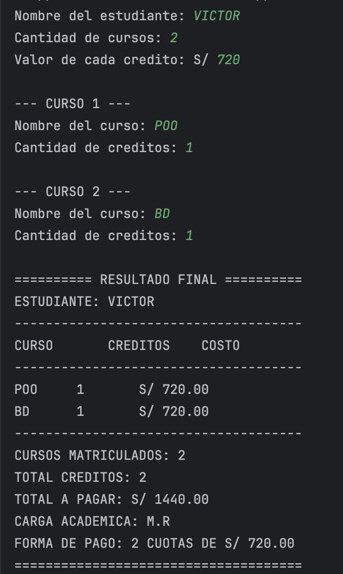

# Semana 02 — Registro de Matrícula

Ejercicio desarrollado en **Kotlin** para registrar los cursos de un estudiante, calcular el costo de matrícula y determinar su carga académica y forma de pago.

## Funcionalidades

- Registro del nombre del estudiante.
- Ingreso de la cantidad de cursos.
- Registro del nombre y créditos de cada curso.
- Cálculo del costo por curso.
- Cálculo del total de créditos.
- Cálculo del total a pagar.
- Determinación de la carga académica.
- Determinación de la cantidad y valor de las cuotas.

## Condiciones

### Carga académica

- Hasta **12 créditos**: M.R.
- De **13 a 18 créditos**: Carga completa.
- Más de **18 créditos**: Requiere autorización.

### Forma de pago

- Si el total supera los **S/ 2300**: 3 cuotas.
- En caso contrario: 2 cuotas.

## Evidencias




## Ejemplo de resultado

```text
========== RESULTADO FINAL ==========
ESTUDIANTE: VICTOR
-------------------------------------
CURSO           CREDITOS        COSTO
-------------------------------------
BD              4               S/ 720.00
POO             4               S/ 720.00
-------------------------------------
CURSOS MATRICULADOS: 2
TOTAL CREDITOS: 8
TOTAL A PAGAR: S/ 1440.00
CARGA ACADEMICA: M.R
FORMA DE PAGO: 2 CUOTAS DE S/ 720.00
=====================================


