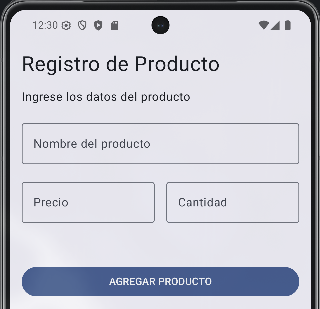
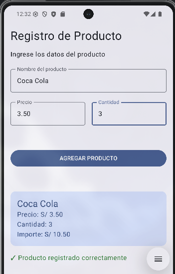

# Lab 03 - Registro de Producto

**Nombre:** Victor Santamaria

## Descripción

Aplicación desarrollada con Kotlin y Jetpack Compose para registrar
un producto mediante un formulario.

La aplicación permite ingresar el nombre del producto, precio y
cantidad, y posteriormente muestra un resumen con el importe
calculado.

## Evidencias

### Pantalla vacía

### Producto registrado

## Pregunta

### ¿Qué pasaría si declaras las variables de los campos SIN `remember`?

Al probar la app sin usar `remember`, los valores de los
campos no se conservan cuando ocurre una recomposición. Entonces por ello es la
importancia de usar `remember` para que conserve el estado aun si redibuja la variable en pantalla.
