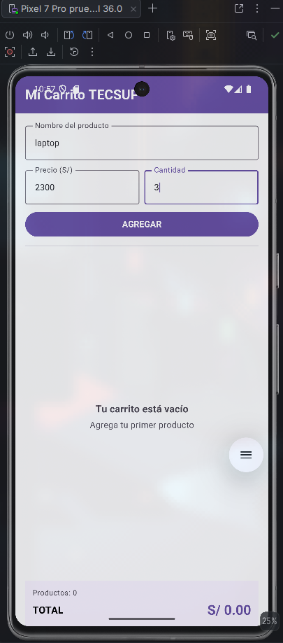
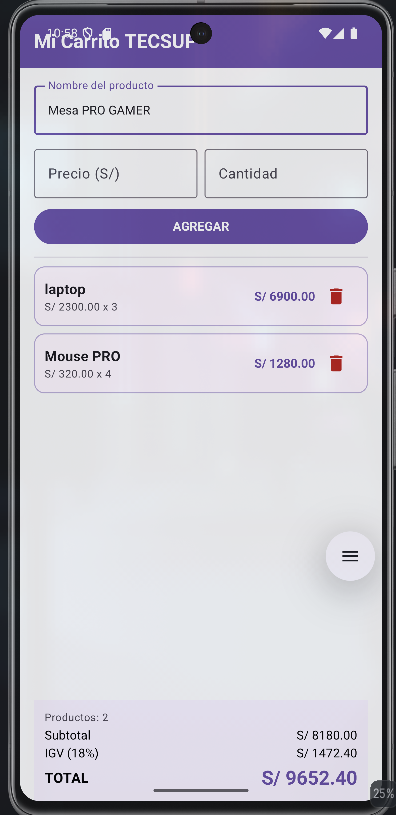

# Lab 04 - Mi Carrito TECSUP

## Autor

Victor Santamaria

## Descripción

Aplicación Android desarrollada con Kotlin y Jetpack Compose que permite
registrar productos en un carrito de compras, visualizarlos mediante una
LazyColumn, eliminar productos y calcular automáticamente el subtotal,
IGV y total de la compra.

## Funcionalidades

- Registro del nombre, precio y cantidad de un producto.
- Validación de los datos ingresados.
- Lista observable de productos.
- Visualización de productos mediante LazyColumn.
- Tarjetas individuales para cada producto.
- Cálculo del importe según precio y cantidad.
- Eliminación de productos del carrito.
- Cálculo automático del subtotal.
- Cálculo del IGV del 18%.
- Cálculo del total.
- Estado visual cuando el carrito está vacío.

## Capturas

### Carrito vacío

### Carrito con productos

## Preguntas conceptuales

### ¿Por qué usamos mutableStateListOf y no una MutableList normal?

`mutableStateListOf` crea una lista observable por Jetpack Compose.
Cuando agregamos o eliminamos un producto, Compose detecta el cambio y
actualiza automáticamente la interfaz.

Una `MutableList` normal puede modificar sus elementos, pero Compose no
observa directamente esos cambios, por lo que la interfaz no
necesariamente se recompondría al modificar la lista.

### ¿Por qué la lista se declara con val si podemos agregar elementos?

`val` impide reasignar la variable `productos` a otra lista, pero no hace
inmutables los elementos del objeto al que hace referencia.

Por eso no podemos hacer:

productos = otraLista

pero sí podemos modificar la lista existente:

productos.add(producto)
productos.remove(producto)

### ¿Qué hace weight(1f) en la LazyColumn?

`weight(1f)` hace que la LazyColumn utilice el espacio disponible dentro
de la Column.

En este proyecto permite que la lista de productos ocupe el espacio
central disponible mientras el panel de totales permanece fijo en la
parte inferior de la pantalla.
