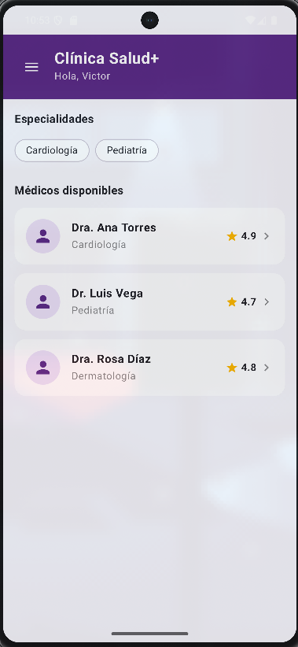
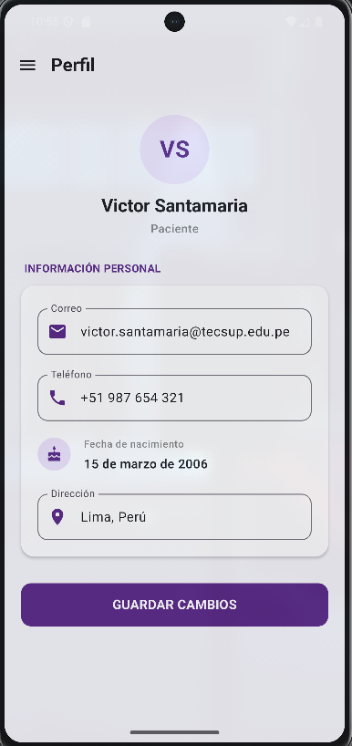

# Clínica Tecsup - CON IA

Aplicación Android desarrollada con **Kotlin, Jetpack Compose, Material 3 y Navigation Compose**.

Esta carpeta corresponde a la versión **CON IA** de la actividad Clínica Tecsup. Se partió de la versión funcional desarrollada previamente y se utilizó IA para mejorar la interfaz, conservar el flujo de navegación existente e incorporar nuevas funcionalidades.

---

## Tecnologías utilizadas

- Kotlin
- Jetpack Compose
- Material 3
- Navigation Compose
- Android Studio

---

## Requerimientos funcionales

### RF01 - Pantalla principal y directorio médico

La aplicación debe mostrar la pantalla principal de **Clínica Salud+** con:

- Saludo al paciente.
- Especialidades disponibles.
- Médicos disponibles.
- Nombre y especialidad de cada médico.
- Calificación del médico.
- Acceso al detalle del médico.

También debe permitir filtrar los médicos según la especialidad seleccionada.

**Evidencia:**



---

### RF02 - Perfil del médico

Al seleccionar un médico, la aplicación debe mostrar su información utilizando el identificador `doctorId` recibido mediante Navigation Compose.

Debe mostrar:

- Nombre del médico.
- Especialidad.
- Calificación.
- Descripción profesional.
- Opción para agendar una cita.

**Evidencia:**

<!-- PEGAR CAPTURA RF02 AQUÍ -->

---

### RF03 - Agendamiento de cita

El paciente debe poder seleccionar:

- Una fecha disponible.
- Un horario disponible.

La selección debe diferenciarse visualmente y solo puede existir una fecha y una hora seleccionadas al mismo tiempo.

El botón **Confirmar cita** debe continuar el flujo enviando:

- `doctorId`
- `fecha`
- `hora`

**Evidencia:**


---

### RF04 - Confirmación de cita

Después de confirmar el agendamiento, la aplicación debe mostrar:

- Mensaje de cita agendada.
- Médico seleccionado.
- Fecha.
- Hora.
- Opción **Ver mis citas**.

Los datos se reciben mediante Navigation Compose desde la pantalla anterior.

**Evidencia:**


---

### RF05 - Mis citas

La aplicación debe disponer de una pantalla para visualizar las citas del paciente mediante una lista.

Cada cita debe mostrar:

- Médico.
- Fecha y hora.
- Estado de la cita.

Los estados se diferencian visualmente entre:

- Confirmada.
- Completada.
- Cancelada.

**Evidencia:**


---

### RF06 - Cancelación de citas

Como mejora de la versión **CON IA**, una cita con estado **Confirmada** puede ser cancelada.

Al seleccionar **Cancelar cita**:

1. Se muestra un `AlertDialog`.
2. El usuario confirma o regresa.
3. Al confirmar, el estado cambia de **Confirmada** a **Cancelada**.
4. La interfaz se actualiza mediante estado de Jetpack Compose.

Las citas completadas o ya canceladas no pueden volver a cancelarse.

**Evidencia:**


---

### RF07 - Historial médico

La aplicación debe mostrar el historial médico del paciente.

Cada registro presenta información como:

- Fecha.
- Especialidad.
- Tipo de consulta.
- Médico responsable.

Los registros se presentan mediante Cards manteniendo la identidad visual de la aplicación.

**Evidencia:**


---

### RF08 - Navigation Drawer

La aplicación debe disponer de un menú lateral mediante `ModalNavigationDrawer`.

El Drawer permite navegar hacia:

- Inicio.
- Mis citas.
- Historial médico.
- Perfil.

También muestra la información básica del paciente y diferencia visualmente la opción seleccionada.

**Evidencia:**


---

### RF09 - Perfil del paciente

La opción **Perfil** debe mostrar la información del paciente.

Se presenta:

- Victor Santamaria.
- Rol: Paciente.
- Correo.
- Teléfono.
- Fecha de nacimiento.
- Dirección.

La pantalla mantiene el mismo diseño visual utilizado en Clínica Salud+.

**Evidencia:**


---

### RF10 - Edición local del perfil

Desde el perfil, el paciente puede seleccionar **Editar perfil** y modificar localmente:

- Correo.
- Teléfono.
- Dirección.

Los cambios se realizan utilizando estado de Jetpack Compose y se mantienen durante la ejecución actual de la aplicación.

No se utiliza backend ni base de datos.

**Evidencia:**



---

## Navegación

La aplicación conserva la navegación mediante:

- `NavController`
- `NavHost`
- `composable()`
- `navigate()`
- `popBackStack()`
- `navArgument()`
- `NavType`

El flujo principal es:

```text
INICIO
  │
  ├── seleccionar especialidad → FILTRAR MÉDICOS
  │
  └── seleccionar médico
            │
            ▼
      PERFIL DEL MÉDICO
            │
            ▼
        AGENDAR CITA
            │
            ▼
        CONFIRMACIÓN
            │
            ▼
         MIS CITAS
            │
            └── Cancelar cita → AlertDialog → Cancelada

DRAWER
  ├── Inicio
  ├── Mis citas
  ├── Historial médico
  └── Perfil
         │
         └── Editar perfil → Guardar cambios
```

---

## Estructura principal

```text
com.santamaria.clinicatecsup/
├── MainActivity.kt
├── navigation/
│   ├── Screen.kt
│   ├── AppNavigation.kt
│   └── AppDrawer.kt
└── screens/
    ├── HomeScreen.kt
    ├── DoctorDetailScreen.kt
    ├── AppointmentScreen.kt
    ├── ConfirmationScreen.kt
    ├── AppointmentsScreen.kt
    ├── MedicalHistoryScreen.kt
    └── ProfileScreen.kt
```

---

## Mejoras realizadas con IA

La versión CON IA conserva la lógica principal desarrollada previamente y añade mejoras orientadas a la experiencia de usuario:

- Rediseño visual basado en la interfaz Clínica Salud+.
- Mayor consistencia en Cards, botones, espaciados y colores.
- Estados visuales para las citas.
- Cancelación de citas mediante `AlertDialog`.
- Perfil del paciente integrado al Navigation Drawer.
- Edición local de datos del perfil.
- Conservación de la navegación y argumentos existentes.

---

## Prompt utilizado

El prompt completo empleado para realizar las mejoras con IA se encuentra documentado en:

```text
PROMPT.md
```

---

## Ejecución

1. Abrir `ClinicaTecsup` en Android Studio.
2. Sincronizar Gradle.
3. Seleccionar un emulador o dispositivo Android.
4. Ejecutar la aplicación.
5. Comprobar el flujo completo de navegación.

---

## Autor

**Victor Santamaria**

Proyecto desarrollado para el curso de **Desarrollo de Aplicaciones Móviles - Tecsup**.