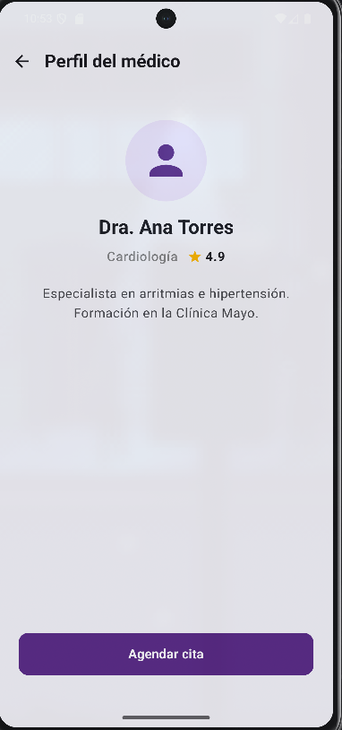
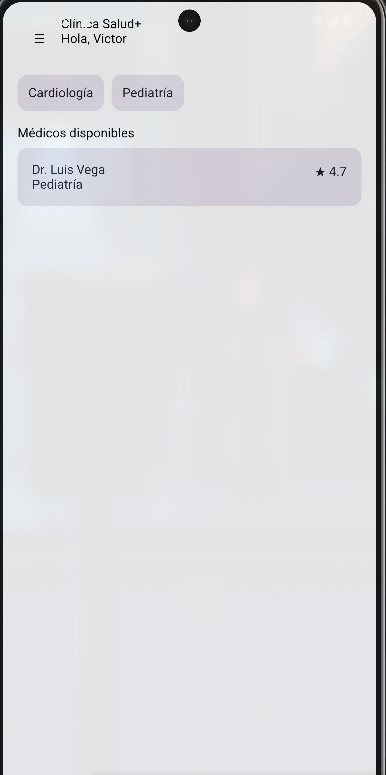
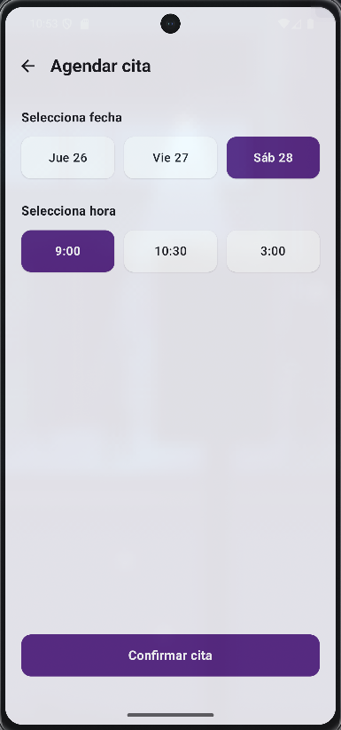
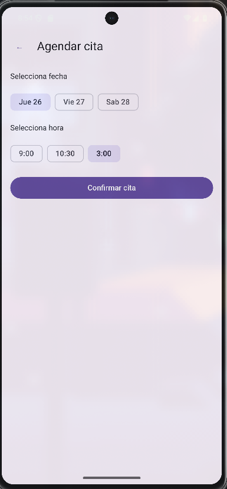
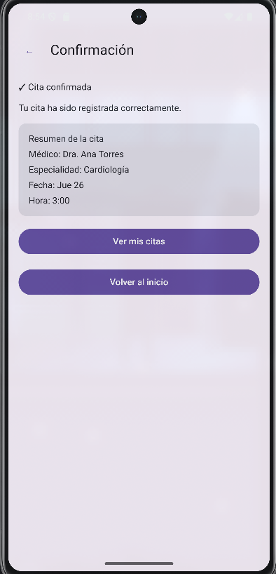
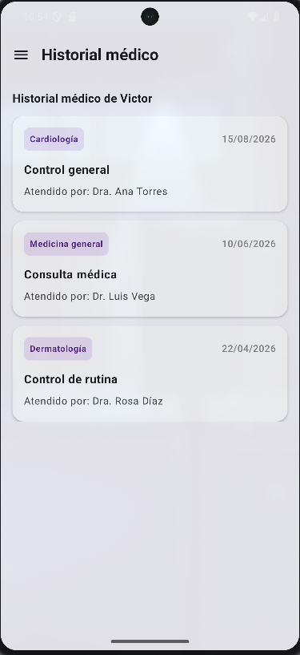
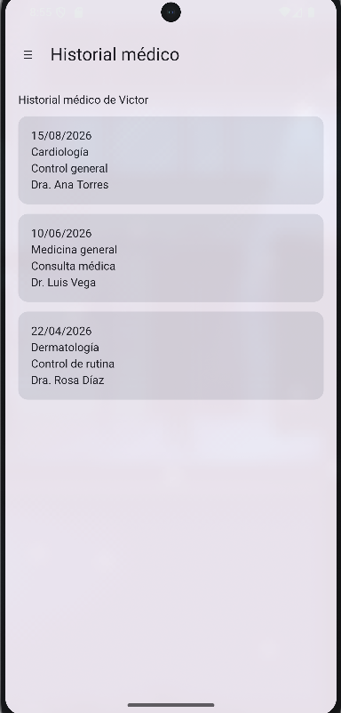
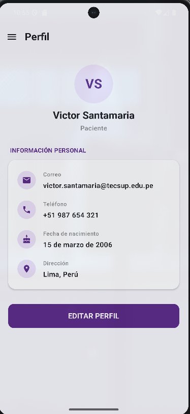

# Clínica TECSUP - SIN IA

Aplicación móvil desarrollada en **Kotlin con Jetpack Compose** para la gestión de citas médicas.

Esta carpeta corresponde a la versión desarrollada **sin IA**, aplicando los conceptos trabajados en clase como Navigation Compose, LazyRow, LazyColumn, manejo de estados y Navigation Drawer.

---

## Requerimientos funcionales

### RF01 - Pantalla principal
Mostrar la pantalla principal de la clínica con:
- Saludo al usuario.
- Especialidades disponibles.
- Médicos disponibles.
- Nombre, especialidad y calificación de cada médico.

Se utiliza `LazyRow` para las especialidades y `LazyColumn` para los médicos.

**Evidencia:**



---

### RF02 - Filtrado por especialidad
Permitir seleccionar una especialidad para mostrar únicamente los médicos pertenecientes a ella.

Especialidades implementadas:
- Cardiología.
- Pediatría.

La selección se controla mediante estados con `remember` y `mutableStateOf`.

**Evidencia:**



---

### RF03 - Perfil del médico
Permitir seleccionar un médico y visualizar su información.

La navegación envía el identificador `doctorId` mediante Navigation Compose.

**Evidencia:**



---

### RF04 - Agendamiento de cita
Permitir seleccionar una fecha y una hora para realizar una cita.

Se implementaron:
- Mínimo 3 fechas.
- Mínimo 3 horarios.
- Selección única de fecha.
- Selección única de hora.

**Evidencia:**



---

### RF05 - Confirmación de cita
Mostrar un resumen de la cita seleccionada con:
- Médico.
- Especialidad.
- Fecha.
- Hora.

Los datos son enviados mediante argumentos de navegación.

**Evidencia:**



---

### RF06 - Mis citas
Mostrar las citas del usuario mediante una lista utilizando `LazyColumn`.

Cada cita muestra información básica y su estado.

**Evidencia:**



---

### RF07 - Historial médico
Mostrar el historial de consultas médicas del usuario.

Cada registro contiene información como fecha, especialidad, consulta y médico.

**Evidencia:**



---

### RF08 - Navigation Drawer
Implementar un menú lateral para navegar entre las secciones principales:

- Inicio.
- Mis citas.
- Historial médico.

Se utiliza `ModalNavigationDrawer` y `rememberDrawerState`.

**Evidencia:**



---

## Flujo de navegación

```text
Home
 └── DoctorDetail/{doctorId}
       └── Appointment/{doctorId}
             └── Confirmation/{doctorId}/{fecha}/{hora}
                   └── Appointments

Navigation Drawer
 ├── Inicio
 ├── Mis citas
 └── Historial médico