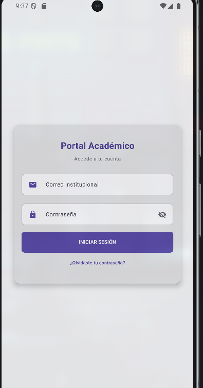
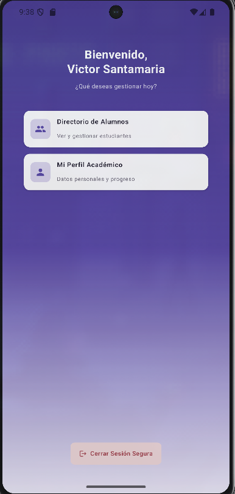
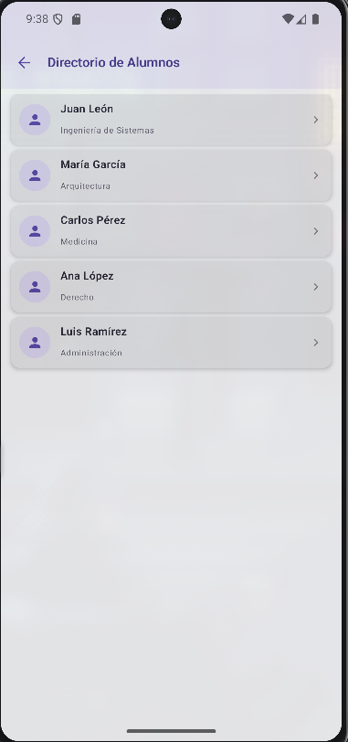
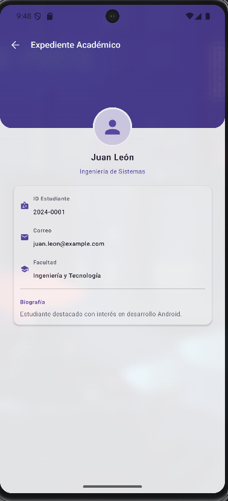
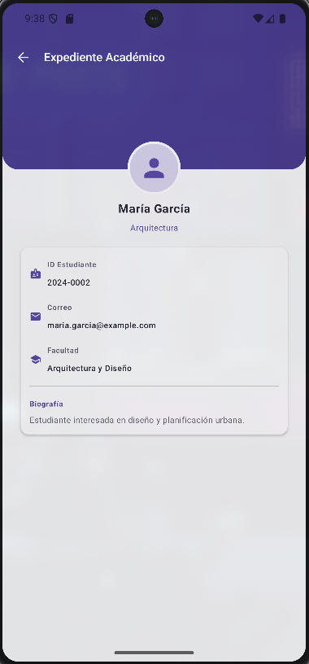
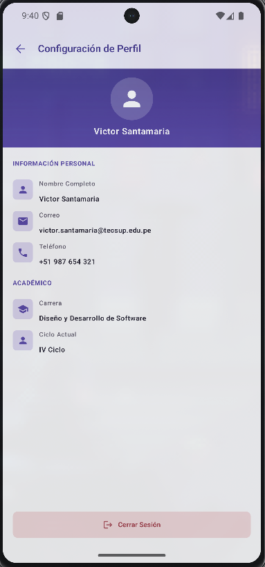

# NavLab - Portal Académico | CON IA

Aplicación Android desarrollada con **Kotlin, Jetpack Compose y Navigation Compose**.

Esta carpeta corresponde a la versión **CON IA** de la actividad de navegación. Se partió del flujo desarrollado previamente y se utilizó IA para adaptar la aplicación a la interfaz solicitada, conservando la navegación mediante `NavController`, `NavHost`, rutas y argumentos.

---

## Requerimientos funcionales

### RF01 - Inicio de sesión

Implementar una pantalla de acceso al Portal Académico.

Debe permitir:

- Ingresar correo institucional.
- Ingresar contraseña.
- Mostrar u ocultar la contraseña.
- Acceder al Home mediante el botón **Iniciar sesión**.

**Evidencia:**

---

### RF02 - Pantalla principal

Mostrar la pantalla principal del Portal Académico con la información del estudiante y los accesos principales.

Debe permitir navegar hacia:

- Directorio de alumnos.
- Perfil académico.
- Cierre de sesión.

**Evidencia:**

---

### RF03 - Directorio de alumnos

Mostrar un listado de estudiantes mediante `LazyColumn`.

Cada estudiante presenta:

- Nombre.
- Carrera.
- Elemento visual de identificación.
- Acceso a su expediente académico.

**Evidencia:**

---

### RF04 - Navegación hacia el detalle

Al seleccionar un estudiante se debe enviar su identificador mediante Navigation Compose.

Se conserva la ruta:

`detail/{itemId}`

y la generación dinámica de la ruta mediante:

`Screen.Detail.createRoute(itemId)`

De esta manera, cada estudiante puede abrir su propio expediente utilizando el identificador recibido.

**Evidencia:**

---

### RF05 - Expediente académico

Mostrar el expediente académico correspondiente al estudiante seleccionado.

La pantalla recibe `itemId` mediante Navigation Compose y utiliza este identificador para determinar qué información debe mostrar.

El expediente presenta:

- Nombre del estudiante.
- Carrera.
- ID del estudiante.
- Correo.
- Facultad.
- Biografía.

La pantalla permite regresar al directorio utilizando `popBackStack()`.

**Evidencia:**

---

### RF06 - Perfil académico

Mostrar la información personal y académica del usuario.

La pantalla presenta:

- Nombre completo.
- Correo.
- Teléfono.
- Carrera.
- Ciclo actual.
- Opción para cerrar sesión.

**Evidencia:**

---

### RF07 - Cierre de sesión

Permitir cerrar la sesión actual y regresar a la pantalla de Login.

El cierre de sesión se encuentra disponible desde las opciones correspondientes de la aplicación y utiliza Navigation Compose para regresar al inicio del flujo.

---

## Flujo de navegación

La aplicación presenta el siguiente flujo:

    LOGIN
      ↓
    HOME
      ├── DIRECTORIO
      │      ↓
      │   DETAIL/{itemId}
      │      ↓
      │    VOLVER
      │
      ├── PERFIL
      │      ↓
      │   CERRAR SESIÓN
      │      ↓
      │    LOGIN
      │
      └── CERRAR SESIÓN
             ↓
           LOGIN

---

## Uso de Inteligencia Artificial

Para la versión CON IA se utilizó Gemini como apoyo para adaptar la interfaz y ampliar el proyecto existente, manteniendo la arquitectura basada en Jetpack Compose y Navigation Compose.

El prompt completo utilizado se encuentra documentado en:

[PROMPT.md](PROMPT.md)
