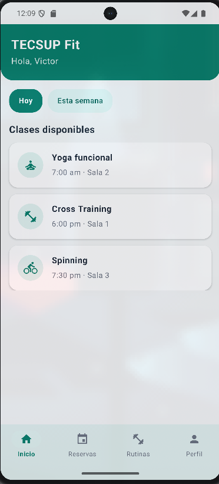
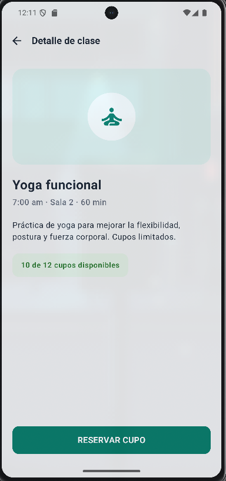
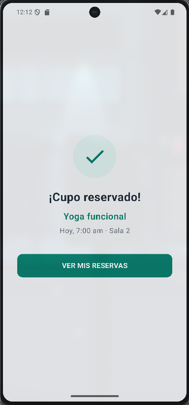
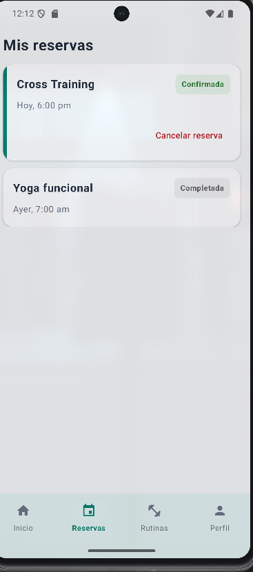
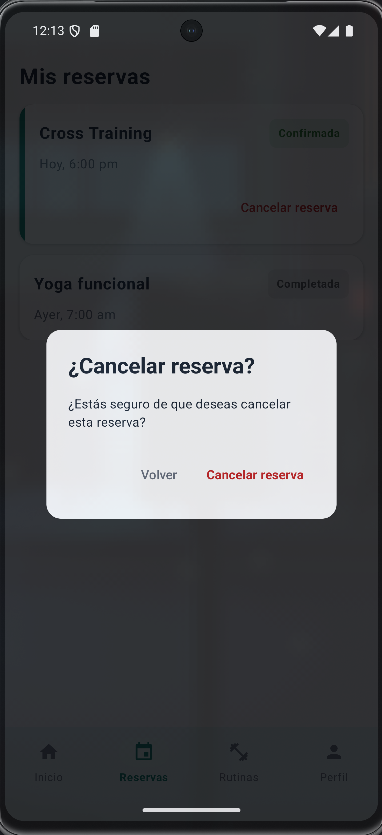
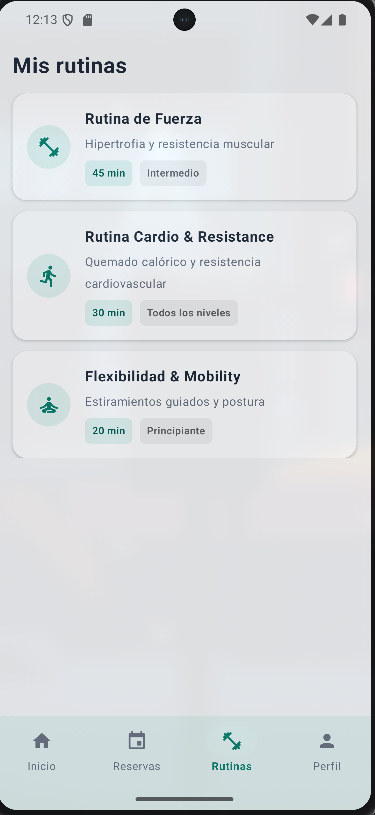
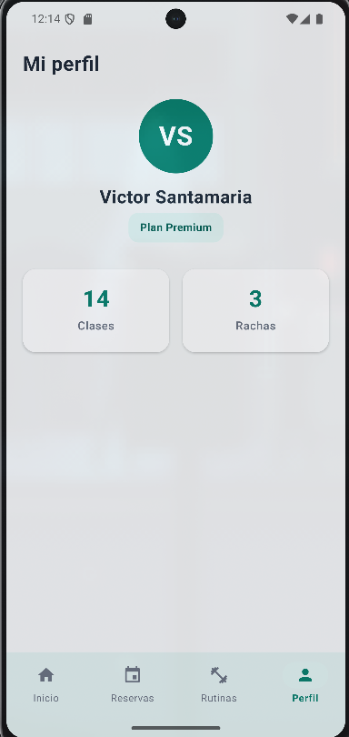

# TECSUP Fit - CON IA

Aplicación Android desarrollada con **Kotlin, Jetpack Compose, Material 3 y Navigation Compose**.

Esta carpeta corresponde a la versión **CON IA** de TECSUP Fit. Se partió de la implementación funcional desarrollada previamente y se utilizó IA para mejorar la interfaz visual, manteniendo la arquitectura y navegación existentes e incorporando una mejora funcional para la gestión de reservas.

---

## Tecnologías utilizadas

- Kotlin
- Jetpack Compose
- Material 3
- Navigation Compose
- Android Studio

---

## Requerimientos funcionales

### RF01 - Pantalla principal

La aplicación muestra la pantalla principal de **TECSUP Fit** con:

- Saludo al usuario.
- Opciones **Hoy** y **Esta semana**.
- Listado de clases disponibles.
- Nombre de la clase.
- Horario.
- Sala correspondiente.
- Acceso al detalle de cada clase.

Las clases mostradas son:

- Yoga funcional.
- Cross Training.
- Spinning.

**Evidencia:**



---

### RF02 - Detalle de clase

Al seleccionar una clase se navega hacia su detalle mediante el argumento `classId`.

La pantalla muestra:

- Nombre de la clase.
- Horario.
- Sala.
- Duración.
- Descripción.
- Cupos disponibles.
- Botón **Reservar cupo**.

La información mostrada depende de la clase seleccionada.

**Evidencia:**



---

### RF03 - Reserva de cupo

Desde el detalle de una clase, el usuario puede seleccionar:

**Reservar cupo**

La aplicación conserva el `classId` de la clase seleccionada y navega hacia la pantalla de confirmación.

**Evidencia:**


---

### RF04 - Confirmación de reserva

Después de reservar un cupo se muestra una pantalla de confirmación con:

- Indicador visual de reserva exitosa.
- Mensaje **¡Cupo reservado!**
- Nombre de la clase.
- Horario.
- Sala.
- Botón **Ver mis reservas**.

**Evidencia:**




---

### RF05 - Mis reservas

La aplicación dispone de una sección **Mis reservas**.

Cada reserva muestra:

- Nombre de la clase.
- Fecha u horario.
- Estado de la reserva.

Los estados se diferencian visualmente:

- Confirmada.
- Completada.
- Cancelada.

**Evidencia:**



---

### RF06 - Cancelación de reserva

Como mejora funcional de la versión **CON IA**, las reservas confirmadas pueden cancelarse.

Al seleccionar **Cancelar reserva**:

1. Se muestra un `AlertDialog`.
2. El usuario puede regresar o confirmar la cancelación.
3. Al confirmar, el estado cambia de **Confirmada** a **Cancelada**.
4. La interfaz se actualiza utilizando estado de Jetpack Compose.

Una reserva completada o cancelada no puede volver a cancelarse.

Esta funcionalidad trabaja localmente y no utiliza backend ni base de datos.

**Evidencia:**



---

### RF07 - Rutinas

La aplicación dispone de una sección **Rutinas**, accesible desde la barra de navegación inferior.

Esta pantalla mantiene la identidad visual de TECSUP Fit y permite acceder al apartado destinado a las rutinas de entrenamiento.

**Evidencia:**



---

### RF08 - Perfil

La aplicación incluye una pantalla de perfil del usuario.

Se muestra:

- Avatar con las iniciales **VS**.
- Victor Santamaria.
- Plan Premium.
- 14 clases.
- 3 rachas.

**Evidencia:**

<!-- PEGAR CAPTURA RF08 -->

---

### RF09 - Barra de navegación inferior

La aplicación utiliza una barra de navegación inferior para acceder a las secciones principales:

- Inicio.
- Reservas.
- Rutinas.
- Perfil.

Cada opción dispone de un icono y texto.

La sección actualmente seleccionada se diferencia visualmente utilizando el color verde principal de TECSUP Fit.

**Evidencia:**



---

## Navegación

La aplicación conserva la navegación implementada mediante:

- `NavController`
- `NavHost`
- `composable()`
- `navigate()`
- `popBackStack()`
- `navArgument()`
- `NavType`

Para el detalle y confirmación se mantiene el argumento:

```text
classId
```

El flujo principal es:

```text
INICIO
   |
   | Seleccionar clase
   v
DETALLE DE CLASE
   |
   | Reservar cupo
   v
CONFIRMACIÓN
   |
   | Ver mis reservas
   v
MIS RESERVAS
   |
   | Cancelar reserva
   v
ALERT DIALOG
   |
   | Confirmar
   v
RESERVA CANCELADA
```

La navegación principal también puede realizarse mediante:

```text
BOTTOM NAVIGATION BAR
├── Inicio
├── Reservas
├── Rutinas
└── Perfil
```

---

## Estructura principal

```text
com.santamaria.smartfit/
├── MainActivity.kt
├── components/
│   └── BottomNavigationBar.kt
├── navigation/
│   ├── Screen.kt
│   └── AppNavigation.kt
└── screens/
    ├── HomeScreen.kt
    ├── ClassDetailScreen.kt
    ├── ConfirmationScreen.kt
    ├── ReservationsScreen.kt
    ├── RoutinesScreen.kt
    └── ProfileScreen.kt
```

---

## Mejoras realizadas con IA

La versión CON IA mantiene la funcionalidad desarrollada previamente e incorpora:

- Interfaz visual basada en la referencia de TECSUP Fit.
- Identidad visual verde.
- Encabezados y Cards mejorados.
- Mejor jerarquía visual y espaciado.
- Indicadores visuales para los estados de las reservas.
- Bottom Navigation Bar mejorada.
- Perfil personalizado para **Victor Santamaria**.
- Cancelación local de reservas confirmadas.
- Confirmación de cancelación mediante `AlertDialog`.

La arquitectura basada en Navigation Compose y el uso de `classId` se mantienen.

---

## Prompt utilizado

El prompt empleado para realizar las mejoras con IA se encuentra documentado en:

```text
PROMPT.md
```

---

## Ejecución

1. Abrir el proyecto en Android Studio.
2. Sincronizar Gradle.
3. Seleccionar un emulador o dispositivo Android.
4. Ejecutar la aplicación.
5. Comprobar el flujo de reserva.
6. Comprobar la cancelación de una reserva.
7. Comprobar las cuatro opciones de la barra inferior.

---

## Autor

**Victor Santamaria**

Proyecto desarrollado para el curso de **Desarrollo de Aplicaciones Móviles - Tecsup**.