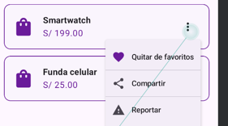

# Laboratorio 06 - Menús y Navegación en Jetpack Compose

Aplicación desarrollada para el curso de **Desarrollo de Aplicaciones Móviles**.

En este laboratorio se trabajó sobre una versión simplificada de **TECSUP Store**, incorporando menús contextuales en las tarjetas de productos y un menú lateral de navegación utilizando componentes de Material 3 y Jetpack Compose.

## Funcionalidades implementadas

### Menú contextual de productos

Cada producto cuenta con un botón de tres puntos que permite desplegar un `DropdownMenu` con las siguientes opciones:

- Favoritos
- Compartir
- Reportar

Las opciones incluyen iconos mediante `leadingIcon` y divisores para mantener una presentación similar al diseño de referencia del laboratorio.

### NavigationDrawer

La aplicación incorpora un `ModalNavigationDrawer` que puede abrirse desde el icono de menú de la barra superior.

El drawer contiene los destinos:

- Inicio
- Mis pedidos
- Favoritos
- Perfil
- Cerrar sesión como opción visual adicional

También incluye un encabezado con las iniciales y datos del usuario.

### Navegación

Los elementos principales del drawer permiten cambiar el contenido mostrado en la aplicación.

El destino actual se mantiene mediante estado de Compose y se utiliza también para resaltar visualmente la opción seleccionada dentro del drawer.

## Estructura principal

```text
com.santamaria.myapplication
├── MainActivity.kt
├── Producto.kt
├── TarjetaProducto.kt
├── AppDrawer.kt
└── AppNavegacion.kt
```

- `MainActivity.kt`: punto de entrada y pantalla principal de TECSUP Store.
- `Producto.kt`: modelo utilizado para representar los productos.
- `TarjetaProducto.kt`: tarjeta de producto y su `DropdownMenu`.
- `AppDrawer.kt`: contenido del `ModalDrawerSheet`.
- `AppNavegacion.kt`: integra el `ModalNavigationDrawer`, controla la navegación y mantiene el estado compartido.

## Evidencias

### 1. Pantalla principal de TECSUP Store


Vista principal con los productos y sus respectivos botones de opciones.

### 2. DropdownMenu de producto


Menú contextual abierto mostrando las opciones Favoritos, Compartir y Reportar.

### 3. NavigationDrawer


Drawer abierto mostrando el encabezado del usuario y los destinos disponibles.

### 4. Navegación a Mis pedidos


Cambio de contenido realizado desde la opción Mis pedidos del NavigationDrawer.

### 5. Destino activo en el drawer


NavigationDrawer mostrando visualmente el destino seleccionado.

### 6. Pantalla de Favoritos


Vista correspondiente al destino Favoritos accedido desde el menú lateral.

## Fase 2 - Mejora asistida con IA

En la segunda fase se mejoró el manejo de productos favoritos mediante un estado compartido en Jetpack Compose.

La opción **Favoritos** del `DropdownMenu` permite agregar o quitar productos. El estado se mantiene en `AppNavegacion`, permitiendo que las tarjetas de productos y el drawer trabajen con la misma información.

El `NavigationDrawer` recibe la cantidad actual de favoritos y muestra un `Badge` dinámico en el item Favoritos. Al quitar un producto de favoritos, el contador también se actualiza automáticamente.

### Flujo implementado

```text
TarjetaProducto
      ↓
DropdownMenu - Favoritos
      ↓
onFavoritoClick
      ↓
AppNavegacion
      ↓
Estado compartido de favoritos
      ↓
AppDrawer
      ↓
Badge con cantidad de favoritos
```

### Evidencias de la Fase 2

#### 7. Producto marcado como favorito



El `DropdownMenu` permite agregar o quitar un producto del estado compartido de favoritos.

#### 8. Contador dinámico de favoritos


El `Badge` del NavigationDrawer muestra la cantidad actual de productos favoritos y se actualiza al modificar la selección.

### Uso de IA

Durante la Fase 2 se utilizó IA como apoyo para implementar el estado compartido de favoritos y conectar su cantidad con el `NavigationDrawer`.

Los prompts utilizados y las correcciones realizadas durante la implementación se encuentran documentados en `PROMPTS.md`.

## Preguntas de reflexión

### 1. ¿Por qué el DropdownMenu se declara dentro de un Box junto al ícono de 3 puntos y no en cualquier lugar de la pantalla?

El `DropdownMenu` se coloca dentro de un `Box` junto al botón de tres puntos porque así queda asociado visualmente al elemento que lo abre. El `Box` permite mantener ambos componentes relacionados, haciendo que cuando cambie el estado `expanded`, el menú aparezca junto al botón correspondiente de la tarjeta y no como un elemento independiente de la pantalla.

### 2. ¿Cuál es la diferencia entre el alcance de un DropdownMenu y un NavigationDrawer?

El `DropdownMenu` tiene un alcance específico y contextual. En este laboratorio se utiliza para realizar acciones relacionadas con un producto, como agregarlo a favoritos, compartirlo o reportarlo.

En cambio, el `NavigationDrawer` tiene un alcance general dentro de la aplicación, ya que permite navegar entre las secciones principales como Inicio, Mis pedidos, Favoritos y Perfil.

### 3. En la Fase 2, ¿cómo se logra que el contador de favoritos del drawer conozca cuántos productos fueron marcados desde las tarjetas?

Se utilizó un estado compartido en `AppNavegacion`. Cada `TarjetaProducto` comunica la acción de agregar o quitar un producto mediante `onFavoritoClick`.

`AppNavegacion` mantiene la lista de favoritos y envía `favoritos.size` hacia `AppDrawer`. De esta manera, el `Badge` del item Favoritos utiliza la misma información y se actualiza automáticamente cuando se agrega o quita un producto.

El flujo utilizado fue:

```text
TarjetaProducto
      ↓
onFavoritoClick
      ↓
AppNavegacion
      ↓
Estado compartido de favoritos
      ↓
favoritos.size
      ↓
AppDrawer
      ↓
Badge
```

### 4. ¿Qué tuviste que corregir del código generado con IA y por qué?

Durante la implementación con IA se tuvo que corregir principalmente la distribución de `TarjetaProducto`. En una primera integración, el nombre y el precio quedaron comprimidos y los componentes se mostraban de forma incorrecta.

Para solucionarlo se reorganizó la tarjeta utilizando un `Row` como contenedor principal, una `Column` con `Modifier.weight(1f)` para distribuir correctamente el espacio del nombre y precio, y un `Box` para mantener el `DropdownMenu` asociado al botón de tres puntos.

También se revisó dónde debía mantenerse el estado de favoritos. Finalmente se dejó en `AppNavegacion`, ya que las tarjetas y el drawer necesitan trabajar con la misma información.

## Observaciones

1. En la Fase 1, el `DropdownMenu` y el `NavigationDrawer` podían funcionar de manera independiente. En la Fase 2 fue necesario comunicar los composables para que una acción realizada desde una tarjeta también pudiera reflejarse en el drawer.

2. El uso de IA permitió avanzar rápidamente con la implementación del estado compartido y el `Badge`, pero fue necesario revisar y probar el resultado. Durante la integración apareció un problema en la distribución visual de las tarjetas que tuvo que corregirse antes de continuar.

## Conclusiones

1. El laboratorio permitió diferenciar el propósito de los menús utilizados en Jetpack Compose. El `DropdownMenu` permite realizar acciones contextuales sobre un elemento, mientras que el `NavigationDrawer` permite organizar la navegación general de la aplicación.

2. La Fase 2 permitió aplicar el manejo de estado compartido entre composables. Al mantener los favoritos en `AppNavegacion`, fue posible comunicar `TarjetaProducto` con `AppDrawer` y actualizar dinámicamente el contador sin mantener estados separados.

## Tecnologías utilizadas

- Kotlin
- Jetpack Compose
- Material 3
- Material Icons
- Android Studio
- Git y GitHub

## Autor

**Victor Santamaria**  
TECSUP - Desarrollo de Aplicaciones Móviles