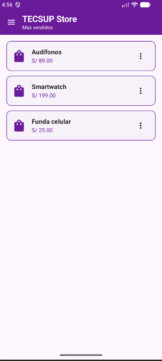
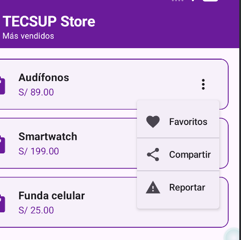
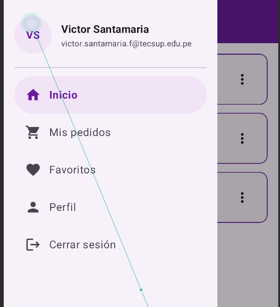
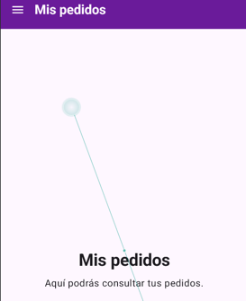
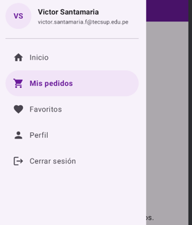
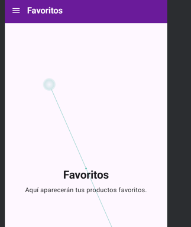

# Laboratorio 06 - Menús y Navegación en Jetpack Compose

Aplicación desarrollada para el curso de **Desarrollo de Aplicaciones Móviles**.

En este laboratorio se trabajó sobre una versión simplificada de **TECSUP Store**, incorporando menús contextuales en las tarjetas de productos y un menú lateral de navegación utilizando componentes de Material 3 y Jetpack Compose.

## Funcionalidades implementadas

### Menú contextual de productos

Cada producto cuenta con un botón de tres puntos que permite desplegar un `DropdownMenu` con las siguientes opciones:

- Favoritos
- Compartir
- Reportar

Las opciones incluyen iconos mediante `leadingIcon` y divisores para mantener una presentación similar al diseño de referencia del laboratorio.

### NavigationDrawer

La aplicación incorpora un `ModalNavigationDrawer` que puede abrirse desde el icono de menú de la barra superior.

El drawer contiene los destinos:

- Inicio
- Mis pedidos
- Favoritos
- Perfil
- Cerrar sesión como opción visual adicional

También incluye un encabezado con las iniciales y datos del usuario.

### Navegación

Los elementos principales del drawer permiten cambiar el contenido mostrado en la aplicación.

El destino actual se mantiene mediante estado de Compose y se utiliza también para resaltar visualmente la opción seleccionada dentro del drawer.

## Estructura principal

```text
com.santamaria.myapplication
├── MainActivity.kt
├── Producto.kt
├── TarjetaProducto.kt
├── AppDrawer.kt
└── AppNavegacion.kt
```

- `MainActivity.kt`: punto de entrada y pantalla principal de TECSUP Store.
- `Producto.kt`: modelo utilizado para representar los productos.
- `TarjetaProducto.kt`: tarjeta de producto y su `DropdownMenu`.
- `AppDrawer.kt`: contenido del `ModalDrawerSheet`.
- `AppNavegacion.kt`: integra el `ModalNavigationDrawer` y controla la navegación.

## Evidencias

### 1. Pantalla principal de TECSUP Store



Vista principal con los productos y sus respectivos botones de opciones.

### 2. DropdownMenu de producto



Menú contextual abierto mostrando las opciones Favoritos, Compartir y Reportar.

### 3. NavigationDrawer



Drawer abierto mostrando el encabezado del usuario y los destinos disponibles.

### 4. Navegación a Mis pedidos



Cambio de contenido realizado desde la opción Mis pedidos del NavigationDrawer.

### 5. Destino activo en el drawer



NavigationDrawer mostrando visualmente el destino seleccionado.

### 6. Pantalla de Favoritos



Vista correspondiente al destino Favoritos accedido desde el menú lateral.

## Tecnologías utilizadas

- Kotlin
- Jetpack Compose
- Material 3
- Material Icons
- Android Studio
- Git y GitHub

## Autor

**Victor Santamaria**  
TECSUP - Desarrollo de Aplicaciones Móviles